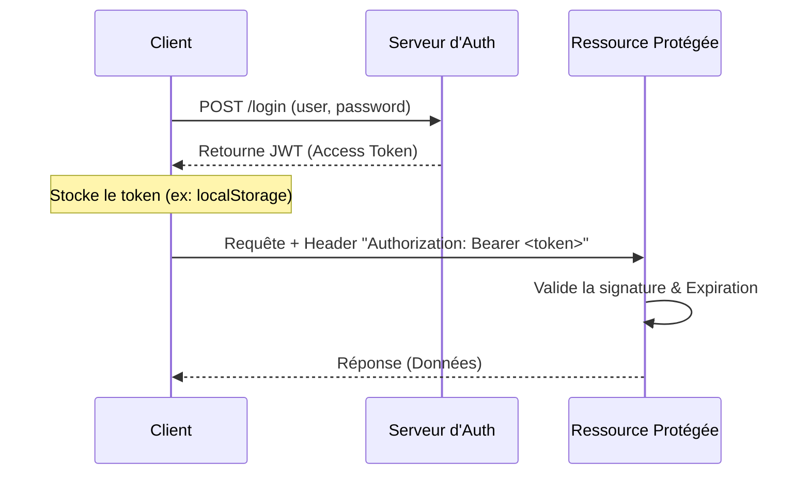
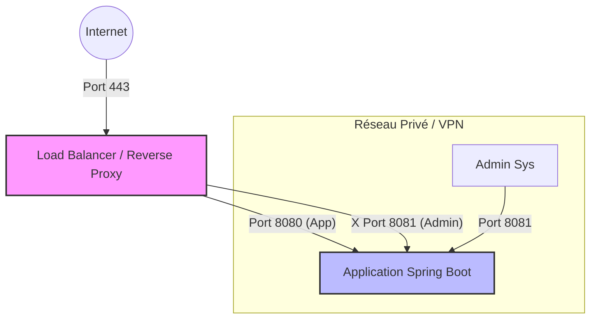

# Sécuriser une application Spring Boot : Guide Avancé (JWT, RBAC, ABAC, PBAC)

La sécurité applicative ne se limite pas à l'authentification. Elle repose sur une gestion fine des accès et une protection rigoureuse des interfaces d'administration. Ce guide explore les mécanismes avancés de sécurité dans l'écosystème Spring Boot.

## 1. Authentification Moderne avec JWT (JSON Web Tokens)

### Comprendre le JWT
Le JWT est un standard ouvert (RFC 7519) qui définit un moyen compact et autonome pour transmettre des informations entre des parties sous forme d'objet JSON.

Il est composé de trois parties séparées par des points (`.`) :
1.  **Header** : L'algorithme de signature (ex: HS256).
2.  **Payload** : Les données (claims) comme l'ID utilisateur, les rôles, l'expiration.
3.  **Signature** : Assure l'intégrité du token.

### Flux d'Authentification



### Implémentation Spring Boot

L'implémentation repose sur un filtre personnalisé qui intercepte chaque requête.

```java
@Component
public class JwtAuthenticationFilter extends OncePerRequestFilter {

    private final JwtService jwtService;
    private final UserDetailsService userDetailsService;

    @Override
    protected void doFilterInternal(HttpServletRequest request, 
                                    HttpServletResponse response, 
                                    FilterChain filterChain) throws ServletException, IOException {
        
        final String authHeader = request.getHeader("Authorization");
        
        if (authHeader == null || !authHeader.startsWith("Bearer ")) {
            filterChain.doFilter(request, response);
            return;
        }

        final String jwt = authHeader.substring(7);
        final String userEmail = jwtService.extractUsername(jwt);

        if (userEmail != null && SecurityContextHolder.getContext().getAuthentication() == null) {
            UserDetails userDetails = this.userDetailsService.loadUserByUsername(userEmail);
            
            if (jwtService.isTokenValid(jwt, userDetails)) {
                UsernamePasswordAuthenticationToken authToken = new UsernamePasswordAuthenticationToken(
                        userDetails, null, userDetails.getAuthorities());
                
                SecurityContextHolder.getContext().setAuthentication(authToken);
            }
        }
        filterChain.doFilter(request, response);
    }
}
```

---

## 2. Stratégies de Contrôle d'Accès : RBAC, ABAC et PBAC

Le cœur de la sécurité réside dans la décision : *"Qui a le droit de faire quoi ?"*.

### RBAC (Role-Based Access Control)
**Définition** : L'accès est basé sur les **rôles** attribués aux utilisateurs. C'est l'approche la plus classique.
*   *Exemple* : Un `ADMIN` peut tout faire, un `USER` ne peut que lire.

**Code Example :**
```java
@RestController
@RequestMapping("/api/v1/management")
public class ManagementController {

    @GetMapping
    @PreAuthorize("hasRole('ADMIN')")
    public String getAdminDashboard() {
        return "Tableau de bord Administrateur";
    }
}
```

### ABAC (Attribute-Based Access Control)
**Définition** : L'accès est basé sur des **attributs** (de l'utilisateur, de la ressource, de l'environnement). C'est une approche contextuelle.
*   *Exemple* : "L'utilisateur peut éditer ce document s'il en est le **propriétaire** (attribut ressource) ET s'il est **9h-17h** (attribut environnement)."

**Code Example :**
```java
@Service
public class DocumentService {

    // Utilisation de SpEL pour vérifier que le propriétaire du document correspond à l'utilisateur connecté
    @PreAuthorize("#document.owner == authentication.name")
    public void updateDocument(Document document) {
        // Logique de mise à jour
    }
}
```

### PBAC (Policy-Based Access Control)
**Définition** : Une évolution du ABAC où la logique d'accès est externalisée dans des **politiques** standardisées, souvent gérées par un moteur de règles externe (comme OPA - Open Policy Agent).
*   *Exemple* : "Autoriser l'accès si la politique 'EditPolicy' renvoie true."
*   *Avantage* : Découple totalement la logique de sécurité du code métier.

**Code Example :**
Dans une approche PBAC, l'application agit comme un PEP (Policy Enforcement Point) et délègue la décision à un PDP (Policy Decision Point).

```java
@Service("opaPolicy")
public class OpaPolicyEnforcementPoint {

    private final RestTemplate restTemplate;

    // Vérifie si l'action est autorisée par le moteur de règles externe (ex: OPA)
    public boolean check(String user, String action, String resource) {
        Map<String, Object> input = Map.of(
            "user", user,
            "action", action,
            "resource", resource
        );

        // Appel REST vers le serveur de politique (ex: http://localhost:8181/v1/data/authz/allow)
        Boolean decision = restTemplate.postForObject(
            "http://opa-server/policy/decision", 
            Map.of("input", input), 
            Boolean.class
        );
        
        return Boolean.TRUE.equals(decision);
    }
}

// Utilisation dans le contrôleur
@PreAuthorize("@opaPolicy.check(authentication.name, 'approve', 'loan_application')")
public void approveLoan() {
    // ...
}
```

### Étude Comparative

| Critère | RBAC (Rôle) | ABAC (Attribut) | PBAC (Politique) |
| :--- | :--- | :--- | :--- |
| **Granularité** | Grossière (par groupe) | Fine (par instance/contexte) | Très fine et dynamique |
| **Complexité** | Faible | Moyenne à Élevée | Élevée (nécessite gouvernance) |
| **Flexibilité** | Rigide (nouveau rôle = modif code) | Souple (nouvelles règles) | Très souple (modif politique à chaud) |
| **Cas d'usage** | Apps internes simples, CMS | Apps B2B complexes, RGPD | Systèmes distribués, Microservices |

---

## 3. Sécurisation des Endpoints Actuator

Spring Boot Actuator expose des métriques vitales (`/health`, `/metrics`, `/env`, `/heapdump`). Si ces endpoints sont publics, un attaquant peut récupérer vos clés d'API, mots de passe de BDD, ou faire tomber votre service.

### Risques Majeurs
*   **Fuite d'informations** : `/env` peut révéler des secrets.
*   **Déni de service** : `/heapdump` peut saturer la mémoire et le réseau.

### Architecture de Sécurisation



### Bonnes Pratiques d'Implémentation

1.  **Séparation des Ports** : Configurez Actuator sur un port différent.
    ```properties
    # application.properties
    management.server.port=8081
    management.endpoints.web.exposure.include=health,info,prometheus
    ```

2.  **Authentification Dédiée** : Appliquer une `SecurityFilterChain` spécifique pour le port de management.

```java
@Bean
public SecurityFilterChain actuatorSecurityFilterChain(HttpSecurity http) throws Exception {
    http
        .securityMatcher(EndpointRequest.toAnyEndpoint())
        .authorizeHttpRequests(auth -> auth.anyRequest().hasRole("OPS_ADMIN"))
        .httpBasic(Customizer.withDefaults()); // Auth basique pour les outils de monitoring
    return http.build();
}
```

---

## Conclusion

La sécurité d'une application Spring Boot moderne repose sur une approche en profondeur ("Defense in Depth") :
1.  **Identité** forte via JWT.
2.  **Autorisation** contextuelle via ABAC/PBAC plutôt que simple RBAC.
3.  **Infrastructure** cloisonnée pour les outils d'administration (Actuator).

En adoptant ces patterns, vous protégez non seulement vos données mais aussi la disponibilité et l'intégrité de votre système.
